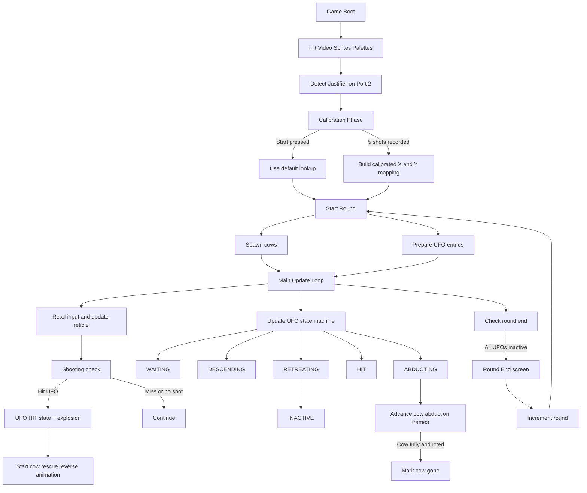

# Cow Abduction

A Sega Genesis / Mega Drive light-gun arcade game built with SGDK.

Shoot UFOs before they abduct cows. Supports Konami Justifier input on port 2, with gamepad fallback aiming.

## Features

- 256px wide H32 game mode
- Multi-point Justifier calibration
- Multi-round UFO attack waves
- Debug build + BlastEm GDB debugging support

## Requirements

For local builds:

- SGDK installed at `/opt/sgdk` (or set `GDK=/path/to/sgdk`)
- `blastem` in `PATH` for `make run`

For container builds:

- Docker
- Image: `schiv-genesis-build`

## Build

Local SGDK:

```bash
make release
make debug
```

Docker (recommended if local SGDK is not installed):

```bash
make docker-release
make docker-debug
```

## Run

```bash
make run
```

This builds release ROM and launches BlastEm with `out/rom.bin`.

## Debug

Build debug ROM first:

```bash
make debug
```

Then launch debugger:

```bash
gdb-multiarch ./out/debug/rom.out -ex "set architecture m68k" -ex "target remote | blastem -D ./out/debug/rom.bin"
```

## Gameplay Flow



## Controls

- Gun trigger: shoot
- Start: skip calibration / reload
- Controller D-pad: move reticle
- Controller A/B: shoot
- Controller C: reload

## Project Layout

- `src/main.c`: initialization, input, frame loop
- `src/game_phases.h`: gameplay state machine and round logic
- `src/game.h`: constants and state structs
- `res/`: sprites, palettes, and generated SGDK resources

## Release Notes

ROM metadata is configured in `src/rom_header.c`.
Update publisher/title/serial before publishing final cartridges or ROM releases.
